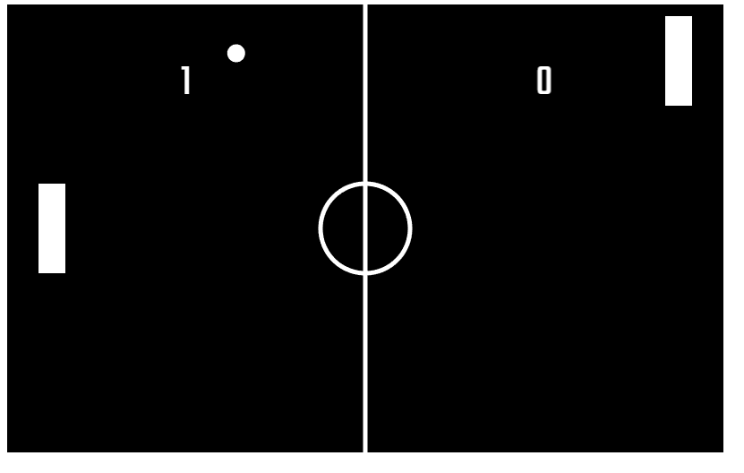

# Pong Game

This is a game design using Phaser 3 framework.

## Built With

- Javascript(ES6)
- HTML
- CSS
- Webpack
- Phaser 3.0

## Live Demo

<a href="https://emmanuelkamala.github.io/">Live Version</a>

## Getting Started

To get a local copy up and running follow these simple example steps.

### Prerequisites
You need to have a web browser

### Setup

# Install
- Clone the repo
- Run 'npm install' command to install package dependencies.

# Run the index file

To run the index file and see the project; enter this command on the command line:
'npm run start'

Then open the browser and enter this link:
http://localhost:8080

## Author

👤 **Author**

- Github: [@githubhandle](https://github.com/emmanuelkamala)
- Twitter: [@twitterhandle](https://twitter.com/ejkamala)
- Linkedin: [linkedin](https://linkedin.com/in/emmanuelkamala)

## 🤝 Contributing

Contributions, issues and feature requests are welcome!

Feel free to check the [issues page](issues/).

## Show your support

Give a ⭐️ if you like this project!

